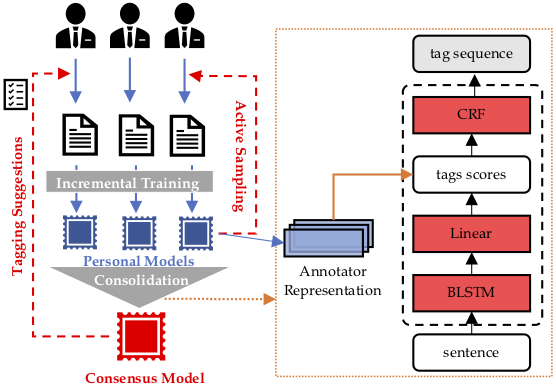
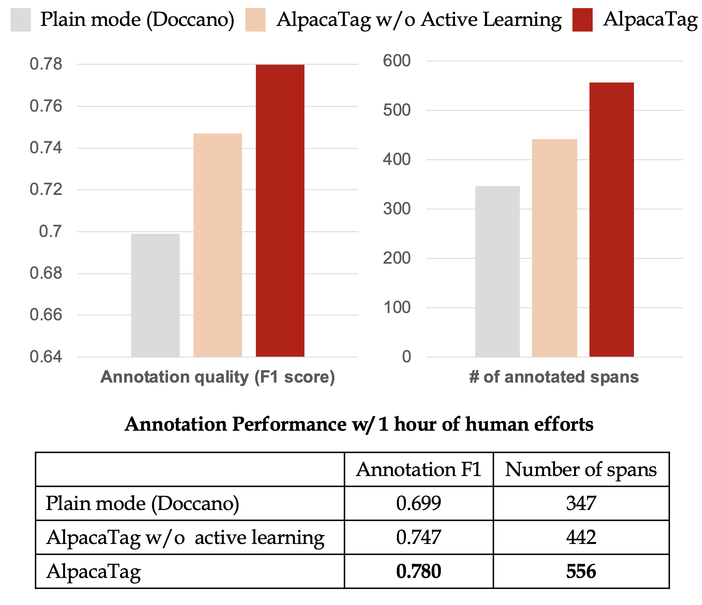

# AlpacaTag
**_AlpacaTag is an active learning-based crowd annotation framework for sequence tagging, such as named-entity recognition (NER)._**


[Website](http://inklab.usc.edu/AlpacaTag/)  &nbsp;&nbsp;&nbsp;&nbsp;    [Documenations](https://github.com/INK-USC/AlpacaTag/wiki/ ) &nbsp;&nbsp;&nbsp;&nbsp;  [Paper](http://inklab.usc.edu/AlpacaTag/acl2019alpaca.pdf) &nbsp;&nbsp;&nbsp;&nbsp; [Poster](http://inklab.usc.edu/AlpacaTag/poster.pdf)

The UI framework of AlpacaTag is based on the awesome work of [Doccano](https://github.com/chakki-works/doccano), while the distinctive advantages of [AlpacaTag](https://github.com/INK-USC/AlpacaTag/) are three-fold:

* **Active intelligent recommendation**: 
dynamically suggesting annotations and sampling the most informative unlabeled instances with a back-end active learned model.  

* **Automatic crowd consolidation**: enhancing real-time inter-annotator agreement by merging inconsistent labels from multiple annotators.  

* **Real-time model deployment**: users can deploy their models in downstream systems while new annotations are being made.  

- Overall Workflow


- Back-end Model APIs


- Crowd Consolidation


- Performance Study


# Documentations
#### **[Installation](https://github.com/INK-USC/AlpacaTag/wiki/Installation)**
#### **[Annotation Tutorial](https://github.com/INK-USC/AlpacaTag/wiki/Annotation-Tutorial)**
#### **[Framework Customization](https://github.com/INK-USC/AlpacaTag/wiki/Framework-Customization)**
#### **[Model Server APIs](https://github.com/INK-USC/AlpacaTag/wiki/Model-Server-API)**


# Citation
```
@InProceedings{acl19alpaca, 
     author = {Bill Yuchen Lin and Dongho Lee and Frank F. Xu and Ouyu Lan and Xiang Ren}, 
     title = {AlpacaTag: An Active Learning-based Crowd Annotation Framework for Sequence Tagging.}, 
     booktitle = {Proceedings of the 57th Annual Meeting of the Association for Computational Linguistics (ACL), Demo Track},
     year = {2018} 
}
```
